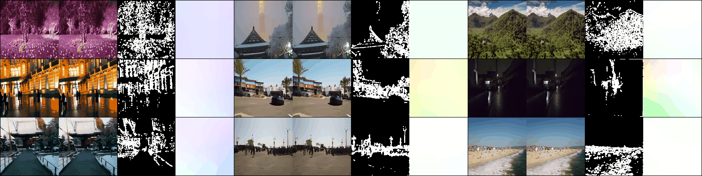

# DMHomo: Learning Homography with Diffusion Models
[dl.acm.org/doi/10.1145/3652207](https://dl.acm.org/doi/10.1145/3652207)

## Data Generator Module (DGM)
### Inference
We prepare the weights of DGM at: https://huggingface.co/Lhaippp/DMHomo/blob/main/DGM.pt

We pre-computed conditions (i.e., mask and homography) for generating training data at: https://huggingface.co/Lhaippp/DMHomo/blob/main/DGM_Conditions.zip
```
cd DGM
# the following code is tested under one 2080Ti GPU with 8 CPUs and 50G memory
python dgm_sample.py -c DGM.pt --exp generate_trainset  --gpu_nums 2 -i 0 --s_step 32 --part 0 --bs 25
```
Process the generate trainset into single npy files for HEM training
```
python generate_nyps_to_single_case.py
```

### Train
We prepare all the necessary data of training DGM at: https://huggingface.co/Lhaippp/DMHomo/tree/main
```
1. BasesHomo_small.npy -> Pseudo Homography Lables
2. Contant-Aware-DeepH-Data.zip & Train_List.txt -> CAHomo Dataset
3. Trainset_Masks_HomoGAN.zip -> Pseudo Dominant Plane Masks

# the download scripts are: 
from huggingface_hub import hf_hub_download

hf_hub_download(repo_id="Lhaippp/DMHomo", filename="BasesHomo_small.npy", local_dir="/root/test/trainset/Contant-Aware-DeepH-Data/Data/Train")
```

Please follow the script in [CAHomo](https://github.com/JirongZhang/DeepHomography) to prepare the train data. And set the path at [class UnHomoTrainData(Dataset)](https://github.com/lhaippp/DMHomo/blob/1a4257fe2c34af9561c16459e59fbe8fb1aec5d2/DGM/denoising_diffusion_models/denoising_diffusion_pytorch.py#L1045).

```
# to set the training config
accelerate config

# start training!
accelerate launch demo.py
```

the default setting is bs=128 & lr=5e-4 that requires about 300G GPU memory. We also test the bs=48 & lr=1e-4 that can be runned on several 2080Tis, some qualitative results are:


- where the first column is generated pairs: [im1, im2]
- the second column is warped pairs: [im1, warpPerspective(im2, condition_homo)]
- the third column is condition dominant plane mask
- the last column is condition_homo (homography -> optical flow -> rgb flow)

## Homography Estimator Module (HEM)
we use [accelerate](https://huggingface.co/docs/accelerate/en/index) for multi-GPUs processing

We prepare the weights of HEM at: https://huggingface.co/Lhaippp/DMHomo/blob/main/HEM.pth
```
# Please set the path of 'CA-Homo Dataset' by [test_data_dir] in HEM/experiments
accelerate launch hem_evaluate.py --model_dir HEM/experiments --restore_file HEM.pth -ow
```

For training HEM
```
cd HEM
# configs for stage-1 are set at HEM/experiments/params.json
accelerate launch train.py --model_dir experiments
```

## Thanks
Our framework builds upon previous benchmarking works; we offer our gratitude to them, including, but not limited to:
- [denoising-diffusion-pytorch (lucidrains)](https://github.com/lucidrains/denoising-diffusion-pytorch)
- [k-diffusion](https://github.com/crowsonkb/k-diffusion)
- [HomoGAN](https://github.com/megvii-research/HomoGAN)
- [PDCNet](https://github.com/PruneTruong/DenseMatching)

## Citation
If you use this code or ideas from our paper for your research, please cite our paper:
```
@article{li2024dmhomo,
  title={DMHomo: Learning Homography with Diffusion Models},
  author={Li, Haipeng and Jiang, Hai and Luo, Ao and Tan, Ping and Fan, Haoqiang and Zeng, Bing and Liu, Shuaicheng},
  journal={ACM Transactions on Graphics},
  year={2024},
  publisher={ACM New York, NY}
}
```
